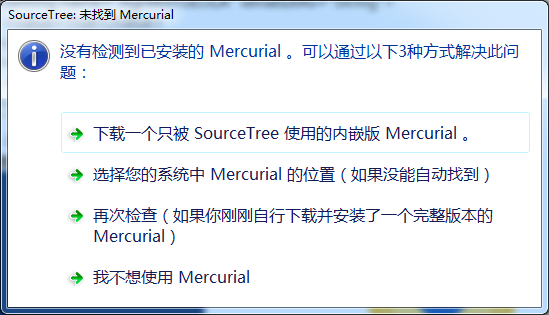

[TOC]
# 一、问题描述
- 第一次安装并打开SourceTree主界面时，会提示进行登录。如果不登录则无法进行使用。

- 点击`Bitbucket`后，会打开网页并且进行授权登录。
- 但是登录成功后，出现了客户端无法进行相应的问题。会一直卡在此界面，无法继续使用。
# 二、解决方案
- 关闭SourceTree客户端。
- 打开`C:\Users\Administrator\AppData\Local\Atlassian\SourceTree`目录，创建`accounts.json`文件，并修改accounts.json内容如下：
```json
[
  {
    "$id": "1",
    "$type": "SourceTree.Api.Host.Identity.Model.IdentityAccount, SourceTree.Api.Host.Identity",
    "Authenticate": true,
    "HostInstance": {
      "$id": "2",
      "$type": "SourceTree.Host.Atlassianaccount.AtlassianAccountInstance, SourceTree.Host.AtlassianAccount",
      "Host": {
        "$id": "3",
        "$type": "SourceTree.Host.Atlassianaccount.AtlassianAccountHost, SourceTree.Host.AtlassianAccount",
        "Id": "atlassian account"
      },
      "BaseUrl": "https://id.atlassian.com/"
    },
    "Credentials": {
      "$id": "4",
      "$type": "SourceTree.Model.BasicAuthCredentials, SourceTree.Api.Account",
      "Username": "",
      "Email": null
    },
    "IsDefault": false
  }
]
```
- 打开`C:\Users\Administrator\AppData\Local\Atlassian\SourceTree.exe_Url_ul4qrk3hz4zqb14vcaiypmrdv255kkqk\3.3.8.3848`（`SourceTree.exe_Url_ul4qrk3hz4zqb14vcaiypmrdv255kkqk\3.3.8.3848`部分根据SourceTree版本不同有所不同）。
    - 第一种方法为：打开user.config文件，在最后`setting`节点后添加如下内容：
```xml
<setting name="AgreedToEULAVersion" serializeAs="String">
  <value>20160201</value>
</setting>
```
再次打开SourceTree客户端，会显示为登录状态，直接点击下一步进行安装。


    - 第二种方法为：打开user.config文件，在最后`setting`节点后添加如下内容：
```xml
<setting name="AgreedToEULA" serializeAs="String">
  <value>True</value>
</setting>
<setting name="AgreedToEULAVersion" serializeAs="String">
  <value>20160201</value>
</setting>
```
再次打开SourceTree客户端，会显示对话框，选择第四个即可进行下一步安装。
